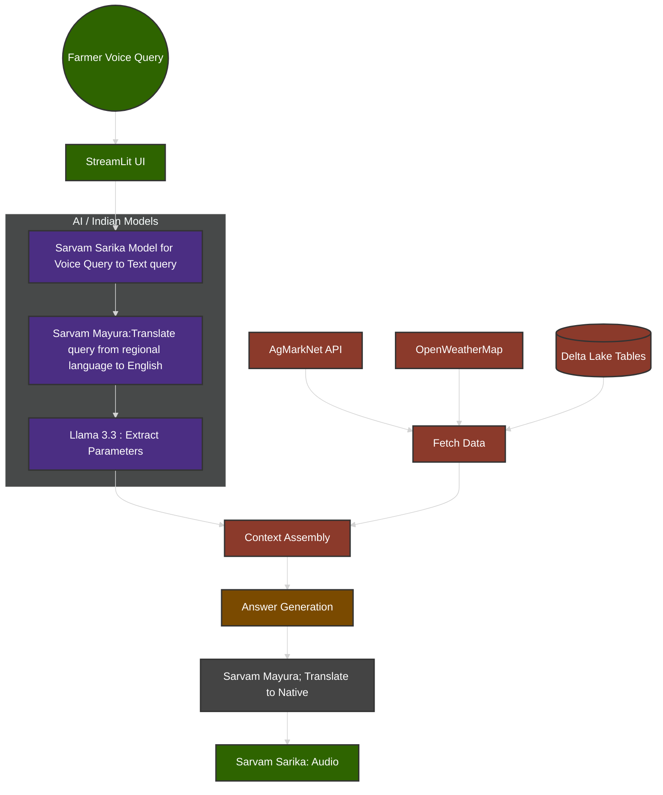

# KisanVaani 

**KisanVaani** is a multilingual AI assistant built on Databricks Lakehouse, providing farmers real-time market and weather insights. Using Sarvam Saarika (STT) and Sarvam Maurya (NLU/Translation), it enables voice-to-voice interaction in Hindi, English, Marathi, and Punjabi. By integrating AgMarkNet and OpenWeatherMap with Delta Lake caching, the system delivers precise, actionable crop advice for any district in under 10 seconds—bridging the digital literacy gap for rural India.

---

## 🏗 System Architecture

This system is hosted on the **Databricks Data Intelligence Platform**, utilizing Delta Lake for data storage and Model Serving for inference.

# KisanVaani v2 System Architecture

This diagram represents the automated flow of the voice-assistant platform.

## How to Run

To launch the **KisanVaani v2** assistant within your Databricks workspace, follow these steps:

1. **Open the Notebook**: Navigate to the `app_launcher.ipynb` file in this repository.
2. **Start the Server**: Run the main execution cell. This will initialize the backend connection to the **Sarvam** and **Llama** model endpoints.
3. **Access the Interface**: 
   - After the cell runs, a **Streamlit Proxy URL** will be generated in the output.
   - Click the link to open the assistant in a new browser tab.

---

##  Demo Steps (How to Use)

Once the application interface is open, follow these steps to interact with the assistant:

### 1. Voice Query
* Click the **Microphone icon** (Start Recording).
* Speak your question clearly in your native language (e.g., Hindi, Marathi, or English).
* *Example:* "What is the current market price for cotton in the Akola Mandi?"

### 2. Real-Time Processing
* **STT:** Watch as the **Sarvam Saarika** model converts your voice into text on the screen.
* **Context:** The system will automatically fetch live data from **AgMarkNet** and **OpenWeatherMap**.

### 3. Response & Playback
* **Answer Card:** A visual card will appear with the specific prices or weather advisory you requested.
* **Audio Playback:** The **Sarvam TTS** engine will automatically play the response back to you in the same language you spoke.

---

##  Tech Stack
* **Platform:** Databricks Lakehouse
* **Models:** Sarvam Saarika (STT), Sarvam Maurya (Translation), Llama 3 70B (LLM)
* **UI:** Streamlit

UI libraries
pip install streamlit sarvam-sdk databricks-sdk pandas

---

## Technology Stack & AI Models

Our solution is built on the **Databricks Data Intelligence Platform**, combining enterprise-grade data orchestration with state-of-the-art Generative AI models optimized for the Indian context.

### Generative AI & Language Models
We utilize a multi-model "Chain of Thought" architecture to bridge the gap between regional dialects and structured data:

* **Sarvam Sarika (Speech-to-Text):** A high-performance STT model specifically tuned for Indian languages, enabling natural voice-based interaction for users.
* **Sarvam Mayura (Translation):** Our core linguistic engine that translates regional queries into English for processing and maps English responses back to the user's native tongue while preserving colloquial context.
* **Meta Llama 3.3 (via Databricks Mosaic AI):** * **Parameter Extraction:** Analyzes translated queries to identify key entities (crops, markets, dates).
    * **Reasoning & Synthesis:** Acts as the central "brain" to generate accurate, context-aware answers by synthesizing real-time API data and historical records.

### Databricks & Data Infrastructure
The backbone of our project leverages **Databricks** for scalable, production-ready data handling:

* **Mosaic AI Model Serving:** Hosts and serves the **Llama 3.3** model via serverless inference, providing low-latency responses and unified API management.
* **Delta Lake:** All agricultural data and weather patterns are stored in **Delta Tables**, ensuring high-performance querying, data versioning, and ACID reliability for our Context Assembly layer.
* **Streamlit Integration:** Connects the frontend UI directly to Databricks, enabling a lightweight and responsive user experience.

---

### Demo Video
[Demo video link ](https://drive.google.com/drive/folders/10um5WEe5CwGIBT_2zj2SXfenSCpC4Q4o?usp=sharing)
